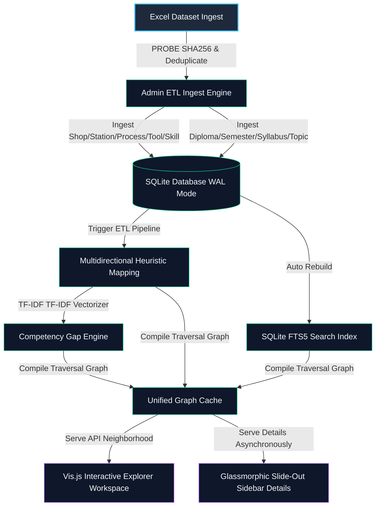

# Offline Industrial Knowledge & Competency Mapping Engine (IIK-CME)

An enterprise-grade, 100% air-gapped, zero-cloud system designed for secure industrial manufacturing environments to synchronize floor operations, tooling assemblies, standard work instructions, academic syllabus programs, and technical competency vectors.



---

## 🌟 Core Pillars

### 1. Zero Cloud Air-Gapped Philosophy
The engine operates in highly secure military-grade or industrial workspaces with **zero internet connectivity**, **zero cloud resources**, and **zero external APIs**.
* **Bundled Assets**: Assets like `vis-network.min.js` and typography fonts are bundled locally.
* **Deterministic Runtime**: All heuristic calculations (scikit-learn TF-IDF) and vector intersections happen entirely on the local workstation host.

### 2. ACID SQLite WAL Core
* **High Concurrency**: Structured around SQLite in Write-Ahead Logging (WAL) mode to protect transaction lifecycles against sudden shop-floor power failures.
* **Declarative Schema**: Managed through SQLAlchemy ORM, enforcing `foreign_keys=ON` on every SQLite connection.

### 3. Universal Knowledge Graph Sync (`graph_engine.py`)
Compiles direct domain matches and 2-hop inferred edges dynamically:
$$\text{Jaccard Similarity} = 0.5 \times \frac{|T_1 \cap T_2|}{|T_1 \cup T_2|} + 0.5 \times \frac{|P_1 \cap P_2|}{|P_1 \cup P_2|}$$
Edges are constructed between workstations with similarity weights exceeding a $0.2$ threshold.

---

## 🛠️ Technology Stack

* **Core Runtime**: Python 3.10+
* **Backend Framework**: Flask (SSR, safe production configuration)
* **ORM Engine**: SQLAlchemy 2.0+
* **Data Processing**: Pandas, NumPy, Scikit-learn (TF-IDF Vectorizer)
* **Virtual Indexing**: SQLite FTS5 (BM25 token-matched search)
* **Frontend Visualization**: Jinja2 HTML5, Vanilla CSS custom design system, Vis.js local bundle

---

## 📖 Excel Ingestion Data Contracts

The admin ingestion module accepts strictly formatted Excel files (`.xlsx` or `.xls`) to populate domain tables.

### 1. Plant Infrastructure Dataset
Contains shopfloor mapping across tooling assemblies:
* **SHOP**: Name of the plant assembly shop (e.g. `TRIM SHOP`).
* **STATIONS**: Workstation ID or identifier (e.g. `STATION_T15`).
* **PROCESS**: Operating process (e.g. `GLASS FITTING`).
* **TOOLS / EQUIPMENT**: Alphanumeric tools list separated by commas (e.g. `TORQUE WRENCH, CALIBRATOR`).
* **OPERATION SUMMARY**: Summary description of the operational steps.
* **SKILL PART**: Target competence or taxonomy group (e.g. `TORQUE ASSEMBLY`).

### 2. Syllabus / Curriculum Dataset
Defines the technical training alignment:
* **Diploma**: Training program stream (e.g. `DIPLOMA IN AUTOMOBILE`).
* **Semester**: Target academic term (e.g. `SEMESTER 1`).
* **Topic**: Comprehensive subject header (e.g. `ASSEMBLY TECHNIQUES`).
* **Sub-Topic**: Granular theory topic (e.g. `TORQUE CALIBRATION TECHNIQUES`).
* **Matched Operation**: Reference standard operation summary text.
* **Skill Part**: Target competence group matching the Plant dataset.

---

## 🚀 Setup & Launch Manual

Ensure you execute commands within the workspace terminal:

### 1. virtualenv Preparation
```bash
# Prepare environment
python -m venv venv
venv\Scripts\activate

# Install offline-safe compiled dependencies
pip install -r requirements.txt
```
*(If `requirements.txt` is not present, install core components manually: `pip install flask sqlalchemy pandas scikit-learn numpy`)*

### 2. Launch Local Server
To start the production-safe engine:
```bash
venv\Scripts\python app.py
```
* **Dashboard Access**: `http://127.0.0.1:5000`
* **Knowledge Explorer**: `http://127.0.0.1:5000/search`
* **Admin Ingest Terminal**: `http://127.0.0.1:5000/admin` (Access credentials: `admin` / `secure_offline_123`)

---

## 🔍 Upgraded Connected Graph Search

The search panel provides an interactive dual-view layout:
1. **Direct Matches**: Instantly retrieves and highlights relevant plant operations, skills, and tools using SQLite FTS5.
2. **Ecosystem Force Graph**: Loads a force-directed Vis.js graph showing the query's 2-hop context in the surrounding manufacturing network.
3. **Glassmorphic Slide-Out Sidebar**: Selecting any card or graph node pulls a drawer from the right, asynchronous loading complete metadata, similar workstations, workstation dependencies, program semester links, and offline learning suggestions.
