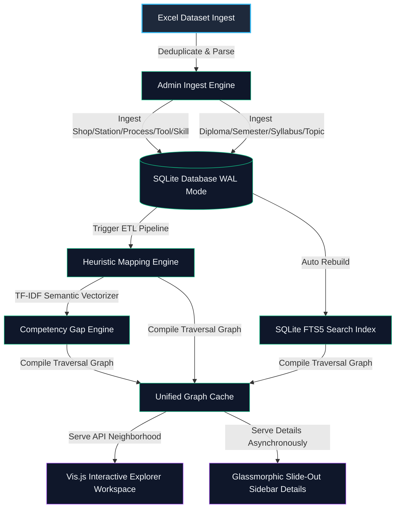
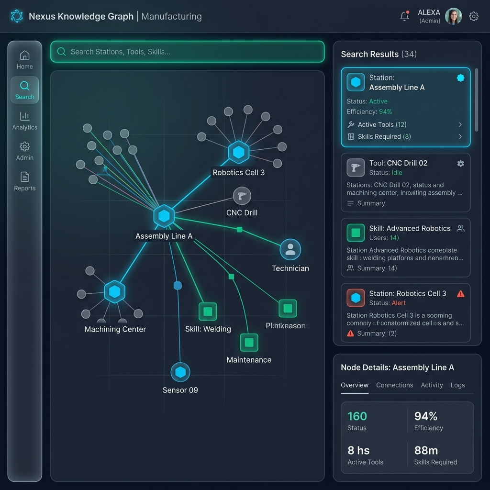
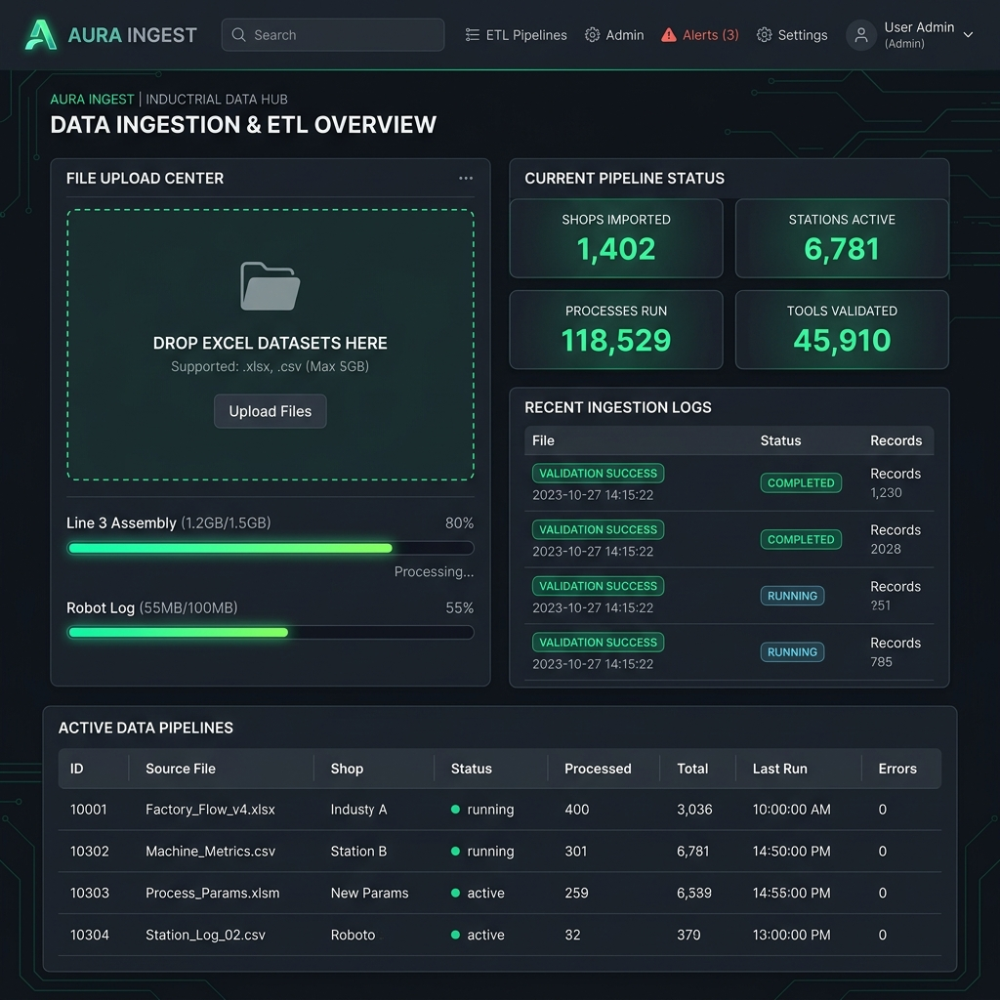
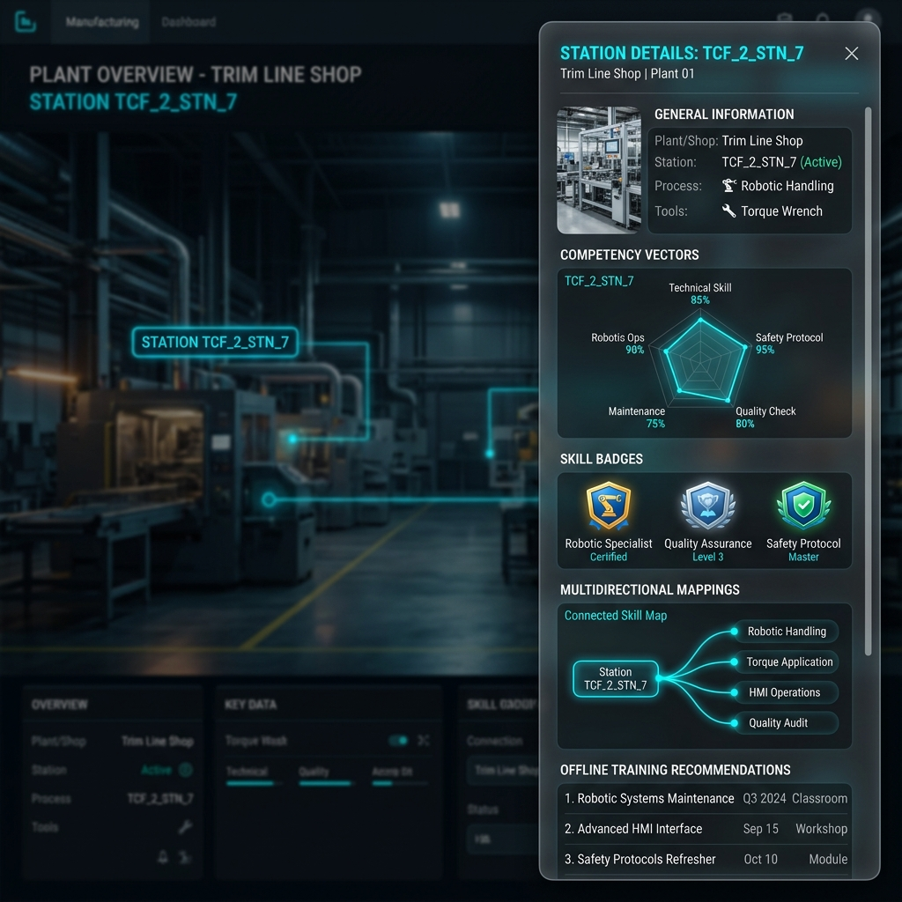
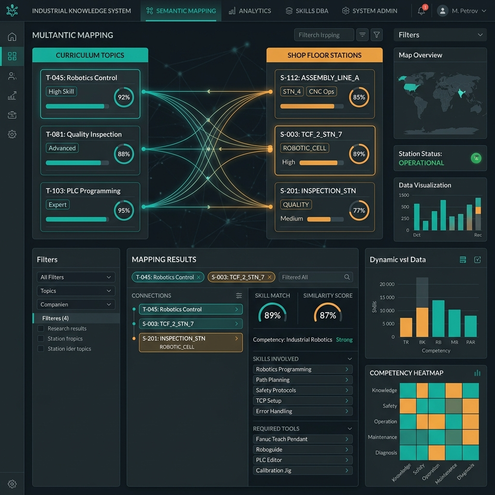

# Industrial Knowledge & Competency Mapping Engine (IIK-CME)

An enterprise-grade, 100% air-gapped, zero-cloud system designed for secure industrial manufacturing environments to synchronize floor operations, tooling assemblies, standard work instructions, academic syllabus programs, and technical competency vectors.

---

## 1. Project Title
**Industrial Knowledge & Competency Mapping Engine (IIK-CME)**  
*Sub-title: An Enterprise-Grade Offline Knowledge Graph & Floor-to-Syllabus Synchronization Suite for Smart Manufacturing (Industry 4.0)*

---

## 2. Executive Summary
The **Industrial Knowledge & Competency Mapping Engine (IIK-CME)** is a production-ready, highly specialized software suite engineered to bridge the critical gap between academic training curricula and shop-floor manufacturing operations. Designed to run completely in secure, air-gapped facilities, the engine processes complex plant data (shops, stations, operations, and tooling constraints) and maps it dynamically to academic syllabi (diploma programs, semesters, and theoretical topics). 

By employing deterministic string metrics, Jaccard similarities, and TF-IDF semantic alignment, IIK-CME compiles a multi-layered industrial knowledge graph. The system enables plant engineers, technical educators, and production planners to trace exact operational dependencies, execute high-speed SQLite FTS5 search queries, uncover competency gaps, and dynamically visualize the entire production-to-training ecosystem via an interactive, responsive, dark-themed industrial UI.

---

## 3. Problem Statement
In modern manufacturing and Industry 4.0 environments, operational efficiency and line-readiness depend heavily on the alignment between standard work instructions (SWIs) and technical workforce competency. However, industrial organizations face two severe challenges:
1. **The Alignment Gap:** Academic or vocational curricula are frequently disconnected from actual floor operations. Mapping theoretical subjects (e.g., *Torque Calibration Principles*) to real workstations (e.g., *TCF_2_STN_7 torque-tightening robotic arms*) is done manually, leading to human errors, training redundancies, and unaddressed skill gaps.
2. **The Air-Gapped Security Constraint:** High-tech manufacturing plants, automotive assembly shops, and defense production lines operate under strict security policies. They are completely disconnected from the internet, forbidding cloud-hosted AI models, external SaaS dependencies, or APIs.

IIK-CME solves these problems by providing a high-performance, deterministic mapping, indexing, and visualization engine that runs entirely local on standard workstations with zero cloud dependencies.

---

## 4. Features
* **100% Air-Gapped Philosophy:** No cloud dependencies, no external APIs. All visualization, indexing, and calculations run on-premise.
* **Deterministic Multidirectional Mapping:** Bridges floor operations $\leftrightarrow$ academic competencies $\leftrightarrow$ tooling specifications using advanced heuristic matching.
* **SQLite FTS5 Semantic Search:** BM25 token-matched virtual indexing for instantaneous retrieval of operational procedures and training topics.
* **Interactive Local Knowledge Graph:** Renders real-time force-directed 2-hop graph neighborhoods locally using a bundled `vis.js` visualization library.
* **Competency Gap Diagnostics:** Automates workforce skill assessments by calculating theoretical-to-operational vector intersections.
* **Enhanced Industrial Context Cards:** High-fidelity, responsive cards presenting the Plant, Shop, Station, Process, and specific tooling constraints at a glance.
* **Professional Admin Ingest Terminal:** Seamless Excel ingestion (`.xlsx`/`.xls`) with auto-deduplication, SHA256 file tracking, and transaction safety.

---

## 5. System Architecture
The engine is structured as a modular monolithic application adhering to a robust Model-View-ControlYou are an expert Principal Full-Stack Software Architect and Database Engineer. Your task is to generate the complete production-ready source code and structural design for an Enterprise Student Lifecycle ERP System from scratch. 

The architecture must strictly follow a decoupled system design: a robust backend API (Python FastAPI or Node.js/Express) and a highly responsive, clean frontend interface (React.js with Tailwind CSS).

---

### MODULE 1: BACKEND DATA ENGINE & ETL (RELATIONAL)

1. SYSTEM INGESTION CORE:
   - Implement a single file upload endpoint (`POST /api/v1/admissions/upload`) that accepts an Excel file (`.xlsx`) containing multiple student tracking sheets (Induction, Admission Data, Document Pending). 
   - STRICT CONSTRAINT: Do not implement dual or multi-file uploads. The pipeline must ingest a single comprehensive master workbook and dynamically handle parsing logic internally.
   - Use an in-memory data parsing engine (like `pandas` or `openpyxl`) to profile and segregate incoming rows.

2. ATTRITION & TARGET FEATURE SEGREGATION LOGIC:
   - Create deterministic pipeline logic to automatically segregate and normalize raw student metrics:
     * Clean and strip academic percentage values (handling formatting noise like '%', '℅', and strings like 'Appear'/'Pursuing' by encoding a separate tracking flag `is_degree_pursuing`).
     * Standardize high-cardinality geographic data (`District Name`, `State`).
     * Dynamically map and compute target variables: Combine operational markers (`Active/Inactive` status, `PCU Admission` status, and text-based dropout `Reason` strings) to handle human entry conflicts and classify each profile into structured relational states: `Active`, `Separated`, or `Pending Completion`.

3. DATA MAPPING & DATABASE INTEGRATION (SQLAlchemy / PostgreSQL):
   - Design a normalized relational schema up to 3NF. Implement the following database model schemas with strict Foreign Key (FK) relationships linked via an autoincrementing integer `student_id`:
     * Students Table: Fields for `ticket_no` (Unique Index), `full_name`, `gender`, `dob`, contact details, and identity numbers.
     * Admissions/Academics Table: Fields for `batch_no` (Indexed), `date_of_joining`, `date_of_admission`, stream/trade branch, cleaned 10th and 12th/ITI percentage floats.
     * Compliance Table: Operational flags for document tracking (`is_lc_submitted`, `pending_documents_array`, `admission_status`).
     * Finance Table: Operational tracking for banking references (`bank_name`, `account_no`, `ifsc_code`, `attendance_payout_eligible`).

4. MULTI-ATTRIBUTE SEARCH & RETRIEVAL ENGINE:
   - Implement an optimized global query API endpoint (`GET /api/v1/students/search`) that accepts query parameters: `batch_no`, `ticket_no`, or `name`.
   - The query logic must allow searching by any of these three attributes (including partial string lookups for the name) and execute efficient joins across the relational tables to return the complete, consolidated data block for matching records.

5. OJT ATTENDANCE MONITORING EXTENSION:
   - Create an independent endpoint (`POST /api/v1/attendance/ojt-sync`) that accepts an On-the-Job Training (OJT) operational activity file.
   - Parse this file to extract attendance logs, update the `attendance_payout_eligible` flag in the Finance table, and dynamically calculate the temporal delta between a student's `date_of_joining` and active OJT tracking days.

---

### MODULE 2: FRONTEND UI & OPERATIONS ENGINE (REACT + TAILWIND)

1. GLOBAL UPLOAD & INTERFACE ENGINE:
   - Provide a clean, unified dashboard drop-zone allowing users to upload the single Master Excel file. 
   - Display immediate transactional upload states (Row Count Parsed, Validation Errors Caught, Database Seeding Progress).

2. ADVANCED SEARCH & CONTROL INTERFACE:
   - Design a top-tier global search query component containing an input bar supporting unified lookups via Batch Number, Ticket ID, or Student Name.
   - Fetch backend results asynchronously as the user types or fires the query, handling states for zero results found or matching criteria ambiguity cleanly.

3. PROFILE FLASHCARD COMPONENT:
   - When a student profile is pulled or selected from the search bar, render their complete data architecture inside an isolated, highly polished, high-fidelity UI panel structured as a "Comprehensive Information Flashcard."
   - Segment the Flashcard UI into 4 visually distinct grids:
     * Card Section A: Core Demographics (Name, Avatar Placeholder, Ticket ID, Batch, Gender, DOB, Contact, Address).
     * Card Section B: Academic Performance & Background (10th/12th/ITI Cleaned Marks, Prior Institute, Stream/Branch, Enrollment Gaps).
     * Card Section C: Document Compliance Tracking Status (Dynamic Visual Badges reflecting document status: Green for Completed, Amber for Pending LC, Red for Critical Delinquencies like Missing Identity Proofs).
     * Card Section D: Attendance & Operational Finance Tracking (OJT Attendance Score, Payout Eligibility Indicator, Bank Account Summary details).

---

### MODULE 3: PRODUCTION SOURCE CODE GENERATION

Generate the full-stack codebase. The code blocks must be self-contained, handling all text-cleaning transformations, explicit relational mappings, clean API schemas, search routes, and a responsive frontend component layout without placeholder code or ellipses.ler (MVC) design pattern, coupled with specialized data and graph processing engines:



---

## 6. Industrial Knowledge Mapping Logic
The heuristic engine uses a multidirectional, multi-layered matching strategy to bind physical shop-floor assets to cognitive educational nodes:

1. **Direct Normalization Mapping:**
   Normalizes and cleans raw text inputs into canonical forms to resolve structural differences (e.g., `TCF 2` $\rightarrow$ `TCF 2`, `Trim Chassis Final 2` $\rightarrow$ `Trim Chassis Final 2`).
2. **Semantic Similarity Score:**
   Combines direct keyword matches, Jaccard similarity, and substring overlaps. For any academic topic $A$ and floor operation $O$, the mapping score $S(A, O)$ is calculated as:
   
   $$S(A, O) = w_1 \cdot \text{Jaccard}(T_A, T_O) + w_2 \cdot \text{TF-IDF-Cosine}(\mathbf{v}_A, \mathbf{v}_O) + w_3 \cdot \text{SubstringOverlap}(A, O)$$

   Where $w_1 = 0.35$, $w_2 = 0.45$, and $w_3 = 0.20$.
3. **Relation Persistence:**
   Maintains a mapped record in the SQLite database only if $S(A, O) \ge 0.40$ (configurable threshold), preventing spurious cross-mappings and ensuring strict training-to-floor accountability.

---

## 7. Search Intelligence Engine
The search module is powered by an offline virtual table indexing system using **SQLite FTS5**.
* **BM25 Token Matching:** The FTS5 index tokenizes text across all entities (Stations, Shops, Processes, Skills, Topics, and Tools) and applies standard BM25 weighting to deliver highly relevant results.
* **Fuzzy Match Fallback:** When FTS5 returns sparse direct matches, the engine invokes a local **RapidFuzz** Levenshtein distance fallback:
  
  $$\text{Levenshtein Ratio}(s_1, s_2) = \frac{|s_1| + |s_2| - \text{dist}(s_1, s_2)}{|s_1| + |s_2|}$$

  This guarantees robust search capabilities even when shop-floor workers use non-standardized shorthand terms or make typographical errors.

---

## 8. Knowledge Graph Architecture
The system constructs a dynamic network graph represented as $G = (V, E)$, compiled inside `graph_engine.py`:
* **Vertices ($V$):** Entity types partitioned into `Shop` (purple), `Station` (red/blue), `Process` (green), `Tool` (orange), `Skill` (yellow), and `Syllabus Topic` (teal).
* **Edges ($E$):** 
  * *Structural Edges:* Hard links representing physical relationships (e.g., $Shop \rightarrow Station \rightarrow Process \rightarrow Tool$).
  * *Semantic Edges:* Computed links between stations based on shared competency dependencies or overlapping tool usage. The semantic similarity between two stations $S_a$ and $S_b$ is defined by:
    
    $$\text{Sim}(S_a, S_b) = 0.5 \times \frac{|T_a \cap T_b|}{|T_a \cup T_b|} + 0.5 \times \frac{|S_{\text{skills}, a} \cap S_{\text{skills}, b}|}{|S_{\text{skills}, a} \cup S_{\text{skills}, b}|}$$

  An edge is dynamically created if $\text{Sim}(S_a, S_b) \ge 0.20$.
* **Traversal Depth:** Up to 2-hop neighborhood expansion, letting users select any node and instantly discover related floor resources and training modules.

---

## 9. Competency Engine
The `competency_engine.py` aggregates skill metrics and performs gap analyses:
* **Competency Vector Space:** Every workforce profile and syllabus is mapped to an $N$-dimensional skill vector.
* **Gap Calculation:** Identifies the difference between the skills demanded by a workstation $S$ and the skills supplied by a curriculum $C$:
  
  $$\mathbf{v}_{\text{gap}} = \max(0, \mathbf{v}_{\text{workstation}} - \mathbf{v}_{\text{curriculum}})$$

* **Actionable Prescriptions:** When a deficiency is detected ($\mathbf{v}_{\text{gap}} > 0$), the engine traces back through the knowledge graph to locate and recommend specific offline modules, standard operating procedures, and training exercises to close the loop.

---

## 10. Tech Stack
* **Runtime:** Python 3.10+ (Air-gapped safe installation)
* **Backend:** Flask (WSGI-compliant routing and API endpoints)
* **Database & ORM:** SQLite 3 (WAL mode enabled), SQLAlchemy 2.0+
* **Data Processing:** Pandas, NumPy
* **Heuristics & Text Analytics:** Scikit-learn (TF-IDF Vectorizer), RapidFuzz
* **Graph Algorithms:** NetworkX 3.0+
* **Frontend Visualization:** Custom modern HTML5/CSS3 (Glassmorphism design system), bundled Vis.js network library, no external CDNs.

---

## 11. Offline Architecture Constraints
* **Zero-CDN Assets:** All stylesheets, scripts (`vis-network.min.js`), and font bundles are hosted locally within `static/` to ensure full operations in high-security, network-isolated industrial plants.
* **ACID Integrity under Sudden Shutdowns:** SQLite configured in Write-Ahead Logging (WAL) mode guarantees database integrity even during abrupt power fluctuations on the shop floor:
  ```python
  @event.listens_for(Engine, "connect")
  def set_sqlite_pragma(dbapi_connection, connection_record):
      cursor = dbapi_connection.cursor()
      cursor.execute("PRAGMA foreign_keys=ON")
      cursor.execute("PRAGMA journal_mode=WAL")
      cursor.execute("PRAGMA synchronous=NORMAL")
      cursor.close()
  ```

---

## 12. Database Design
The relational database schema is structured as follows:

```
+--------------------+       +--------------------+       +-------------------------+
|        Shop        |       |      Station       |       |         Process         |
+--------------------+       +--------------------+       +-------------------------+
| id (PK)            |1    N | id (PK)            |1    N | id (PK)                 |
| shop_code (Unique) |-------| shop_id (FK)       |-------| station_id (FK)         |
| shop_name          |       | station_code       |       | process_code (Unique)   |
+--------------------+       | raw_station_id     |       | process_name            |
                             +--------------------+       +-------------------------+
                                       | 1
                                       |
                                       | N
                          +-------------------------+
                          |   Station-Tool Map      |
                          +-------------------------+
                          | station_id (FK, PK)     |
                          | tool_id (FK, PK)        |
                          +-------------------------+
                                       | N
                                       |
                                       | 1
                             +--------------------+
                             |        Tool        |
                             +--------------------+
                             | id (PK)            |
                             | tool_code (Unique) |
                             | tool_name          |
                             +--------------------+
```

* **Junction Tables:**
  * `station_tool_association`: Binds tools to stations.
  * `skill_station_association`: Mapped skill items to specific stations.
  * `station_operation_association`: Links specific station entities to operational standard descriptions.
  * `syllabus_mapping`: Maps academic syllabus topics to relevant stations based on calculated semantic similarity.

---

## 13. Folder Structure
The repository is strictly structured for clean module separation:

```
Industrial-Knowledge-System/
├── app.py                     # Main Flask entry point and Web API router
├── database.py                # Database engine setup and WAL event listener
├── models.py                  # SQLAlchemy Database schema declarations
├── data_engine.py             # Excel parser, data validator, and Ingest ETL
├── search_engine.py           # SQLite FTS5 search indexer & Levenshtein engine
├── heuristic_engine.py        # Jaccard, Cosine TF-IDF, and substring matcher
├── competency_engine.py       # Skills vector synthesizer & gaps analyser
├── graph_engine.py            # Knowledge graph generator & NetworkX tracer
├── taxonomy.py                # Shop-floor terminology normalizer
├── logger.py                  # Standard structured system logs interface
├── reingest.py                # Administrative data ingestion CLI utility
├── requirements.txt           # Project Python dependencies index
├── LICENSE                    # MIT Open-Source License
├── README.md                  # Project Documentation
├── .gitignore                 # Repo release git exclusion configurations
├── templates/                 # UI HTML Templates
│   ├── index.html             # Homepage dashboard
│   ├── search.html            # Main knowledge graph search layout
│   └── admin.html             # Administrative ETL interface
├── static/                    # Locally bundled assets (No CDN)
│   ├── css/
│   │   └── style.css          # Dark industrial glassmorphic theme styling
│   └── js/
│       └── vis-network.min.js # Local Vis.js library
├── screenshots/               # Repository UI presentation proofs
│   ├── search-ui.png
│   ├── admin-dashboard.png
│   ├── relationship-panel.png
│   └── mapping-results.png
└── uploads/                   # Temporary directory for Excel uploads
    └── .gitkeep               # Preserves uploads folder in git
```

---

## 14. Installation Guide
To prepare the system for local execution on an air-gapped system, transfer the project directory along with the Python wheels for the dependencies listed in `requirements.txt`.

### Windows Setup:
1. Ensure Python 3.10 or 3.11 is installed on the host machine.
2. Open PowerShell in the project directory:
   ```powershell
   python -m venv venv
   .\venv\Scripts\Activate.ps1
   pip install -r requirements.txt
   ```

### Linux Setup:
1. Open a terminal in the project directory:
   ```bash
   python3 -m venv venv
   source venv/bin/activate
   pip install -r requirements.txt
   ```

---

## 15. Local Setup
### Step 1: Initializing & Populating the Database
To run a clean ETL migration using the default industrial datasets:
```bash
python reingest.py
```
This script wipes any existing database, parses the base plant data, normalizes the operational nomenclature, computes mappings, and builds the SQLite FTS5 virtual search index.

### Step 2: Running the Flask Web Server
To launch the system locally:
```bash
python app.py
```
Open your browser and navigate to:
* **Interactive Dashboard:** `http://127.0.0.1:5000`
* **Search and Graph Workspace:** `http://127.0.0.1:5000/search`
* **Admin Ingest Desk:** `http://127.0.0.1:5000/admin` (Default: `admin` / `secure_offline_123`)

---

## 16. How Search Works
1. **FTS5 Ingestion:** During data parsing, all entity names, codes, and operational descriptions are compiled into a virtual FTS5 text index.
2. **Match Execution:** When a query (e.g. `Robotic Arm Torque`) is typed:
   * FTS5 executes a fast indexed match:
     ```sql
     SELECT rowid, rank FROM fts_index WHERE fts_index MATCH 'Robotic* Arm* Torque*'
     ```
   * If direct results exist, they are sorted and displayed based on FTS rank.
3. **Levenshtein Fallback:** If zero matches are found (or for query variations), the system computes RapidFuzz Levenshtein similarity between the search term and database indices, ensuring high fault tolerance.

---

## 17. Multidirectional Mapping Flow
The engine establishes relationships across multiple dimensions:

```
[Academic syllabus topic]
       │
       ▼ (TF-IDF Similarity Match)
[Required Competency Skill]
       │
       ▼ (Skill-Station Mapping)
[Physical Workstation Station]
       │
       ▼ (Station-Process Association)
[Standard Shopfloor Process]
       │
       ▼ (Tooling Specifications)
[Required Tool / Equipment]
```
This enables comprehensive cross-referencing: selecting a physical tool displays all stations using it, the associated processes, and the academic topics that train technicians to operate it.

---

## 18. Screenshots

### Search & Graph Explorer UI
The main search panel features a responsive dual-view interface combining force-directed graphs and detailed list cards.


### Administrative ETL Ingestion Dashboard
The secure dashboard allows engineers to upload new spreadsheets, monitor data parsing logs, and view ingested statistics in real time.


### Relationship Drawer & Details Panel
Selecting any node or card opens a slide-out panel, displaying the exact shop-floor context, tooling specifications, and competency vectors.


### Multidirectional Semantic Mapping Results
Visualization of curriculum-to-operation mappings showing computed similarity scores, matching badges, and learning suggestions.


---

## 19. Future Scope
* **Predictive Competency Forecasting:** Implementing local machine learning models to predict line disruptions based on scheduled training plans.
* **Offline Vector DB Integrations:** Exploring local semantic embeddings using sentence-transformers to replace traditional TF-IDF models.
* **AR Floor Integration:** Providing data hooks to output mapped tooling specifications directly into operators' augmented reality headsets.

---

## 20. Industrial Relevance
In the era of **Smart Manufacturing (Industry 4.0)**, maintaining alignment between actual shop-floor work instructions and training frameworks is paramount. IIK-CME reduces production errors, increases first-time-through (FTT) quality rates, and speeds up worker onboarding. It ensures full data privacy and security by remaining 100% offline.

---

## 21. Resume Impact
Adding IIK-CME to your portfolio showcases expertise in:
* **Industrial Software Architecture:** Designing high-security systems for manufacturing.
* **Offline Knowledge Graph Construction:** Processing graph-based structures using NetworkX and Vis.js.
* **Data Engineering & ETL:** Building pipeline automation scripts in Python (Pandas, SQLAlchemy).
* **Fuzzy & High-Performance Search:** Implementing FTS5 indexes and RapidFuzz for high-accuracy text search.
* **Advanced UI Development:** Creating glassmorphic, highly responsive dark themes using Vanilla CSS.

---

## 22. License
Distributed under the **MIT License**. See `LICENSE` for more information.
